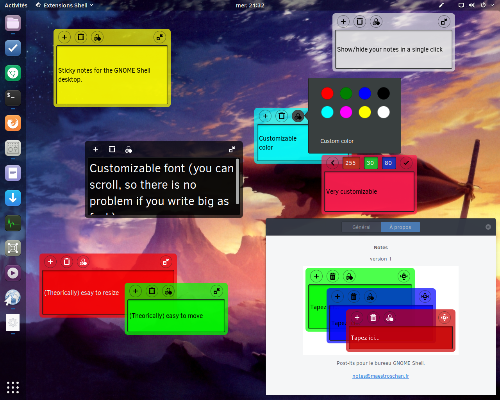

# Sticky notes extension
A GNOME Shell extension providing customizable sticky notes.



----

## Installation

From [here](https://extensions.gnome.org/extension/1357/notes/)

Or like that:

```
cd ~/.local/share/gnome-shell/extensions
git clone https://github.com/Maestroschan/notes-extension-gnome.git
mv notes-extension-gnome-master notes@maestroschan.fr
```

## Storage

Notes are stored in files at `~/.local/share/notes@maestroschan.fr/*_text`
