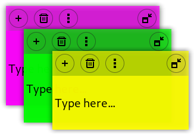

# Sticky notes extension

A GNOME Shell extension providing customizable sticky notes.

----

## Installation

- From [here](https://extensions.gnome.org/extension/1357/notes/)
- Or download & extract the ZIP, and run `./install.sh`

## Storage

Notes are stored in files at `~/.local/share/notes@maestroschan.fr/*_text`

<!-- dans le menu : nouveau/supprimer//éditer le titre//... -->
<!-- le bouton de grab aurait le titre en label, et clic-droit enroulerait -->

<!-- 3.36 :

rétrocompatibilité en sang
déprécation de l'acteur de l'icône, avec conditionnelle
autres erreurs de merde ?

sa mère faut réécrire comment ça interagit avec le disque, là c'est hoooonteux

    -->

