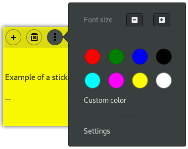

# Basic help manual

## Using the extension

**Show/hide all notes:** click on the icon in the GNOME Shell top bar.

**Create a note:** click on the "+" button at the left of a note header, it will create a new note, with the same color and the same font size as the note you clicked on.

**Move a note:** drag the blank space in the center of the note header.

**Resize a note:** drag the resize button at the right of the note header.

**Delete a note:** click on the wastebasket icon and confirm.

## Customizing notes

**Change color:** click on the menu button, and select a color.

The "Custom color" submenu allows you to select precisely a color.

**Change font size:** click on the menu button, and increase or decrease the font size with "+" and "-" buttons.

**Advanced settings:** click on the "Settings" menu item to access the settings dialog.

## The settings window

The settings dialog window you're reading provides several options:

**Position of notes:** select whether you want the notes to be shown above the windows or underneath them.

**Automatic focus:** if this is enabled, the notes will automatically get the keyboard focus when you hover them with the mouse pointer.

**Keyboard shortcut:** hide/show notes with a keyboard shortcut. If this is enabled, the icon in the top bar can be hidden.

